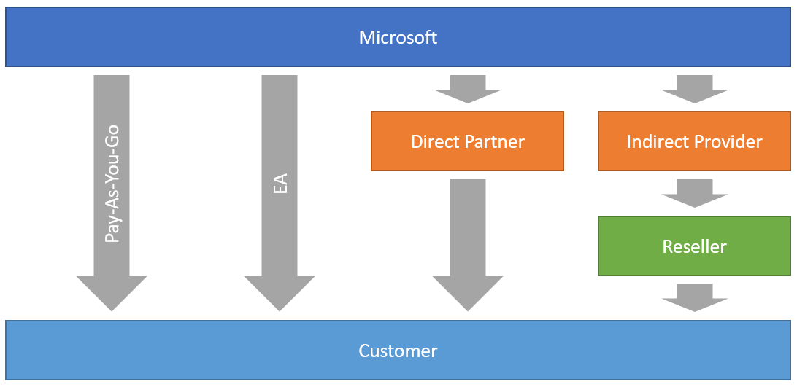

## Azure billing reports (shared services only)

### Different ways of buying Azure Services (Pay-As-You-Go, EA, Direct CSP, Indirect CSP)
Here is a diagram that illustrates the relationships in this model : \

 
### Direct CSP Reseller (Partner Center)
Larger and more mature partners will often opt to become a Direct CSP Reseller. This means that the partner deals directly with Microsoft. \
Here is a diagram that explains the relationships in this model

### Authentification
- Set up API access in Partner Center : https://docs.microsoft.com/en-us/partner-center/develop/set-up-api-access-in-partner-center

- Web Application : \
You must create a web app to call Partner Center REST API :  https://partner.microsoft.com/fr-fr/pcv/apiintegration/appmanagement \
The examples in this section use the (non-working) credentials in the following table.
<table>
  <tr>
    <th>Parameter</th>
    <th>Value</th>
  </tr>
  <tr>
    <td>tenantId</td>
    <td>xxxxxxxxxEXAMPLE</td>
  </tr>
  <tr>
    <td>appId</td>
    <td>xxxxxxxxxEXAMPLE</td>
  </tr>
  <tr>
    <td>appSecret</td>
    <td>SecretEXAMPLE</td>
  </tr>
  <tr>
    <td>sharedTenantId</td>
    <td>xxxxxxxxxEXAMPLE</td>
  </tr>
</table>

### python script example
minimum version : Python 3.6.x
```python
# -*- coding: utf-8 -*-
import config
import requests,json,logging,urllib3,datetime,mysql.connector
from mysql.connector import Error
from datetime import datetime,date
from dateutil.relativedelta import relativedelta
```

### Environment variable
- Variables should be adapted for your specific context
```python
today         = date.today()
endDate       = date(today.year, today.month, 1)
startDate     = endDate + relativedelta(months=-1)
apss_month    = startDate.strftime("%Y-%m-27T00:00:00Z")
BillingPeriod = startDate.strftime("%Y-%m-28")
log = "/var/log/apss_billing.log"
logging.basicConfig(filename=log,level=logging.DEBUG,format='%(asctime)s %(message)s', datefmt='%d/%m/%Y %H:%M:%S')
```

### VAULT AppRole authentication method
```python
vault_role_id     = config.vault_role_id
vault_secret_id   = config.vault_secret_id
vault_login_path  = config.vault_login_path
suivi_secret_path = config.suivi_secret_path
apss_secret_path    = config.apss_secret_path
```

```python
#Get vault token authentification with AppRole
def get_apss_vault_credentials(vault_role_id,vault_secret_id,vault_login_path,apss_secret_path):
    ##if Orange CA not installed
    urllib3.disable_warnings()

    payload = {"role_id": vault_role_id, "secret_id": vault_secret_id}
    r = requests.post(vault_login_path, json=payload, verify=False)
    token = r.json()['auth']['client_token']
    r = requests.get(apss_secret_path, headers={"X-Vault-Token":token}, verify=False)
    if r.status_code == 200:
        logging.info(f"Vault token: {r.status_code}")
        vault_result = r.json()
        return vault_result
    else:
        logging.info(f"vault token error: {r.status_code}")
```

### Get apss url + credentials
```python
vault_result = get_apss_vault_credentials(vault_role_id,vault_secret_id,vault_login_path,apss_secret_path)
apss_tenantId = vault_result['data']['tenantId']
apss_appId = vault_result['data']['appId']
apss_appSecret = vault_result['data']['appSecret']
apss_sharedTenantId = vault_result['data']['sharedTenantId']
apss_token_url         = f'https://login.microsoftonline.com/{apss_tenantId}/oauth2/token'
apss_data              = f'grant_type=client_credentials&client_id={apss_appId}&client_secret={apss_appSecret}&resource=https://graph.windows.net'
apss_subscriptions_url = f'https://api.partnercenter.microsoft.com/v1/customers/{apss_sharedTenantId}/subscriptions'
apss_customers_url     = f'https://api.partnercenter.microsoft.com/v1/customers/{apss_sharedTenantId}'
apss_invoices_url      = f'https://api.partnercenter.microsoft.com/v1/invoices/'
apss_r                 = requests.post(apss_token_url, data=apss_data)          
apss_token_request     = apss_r.json()
apss_token             = apss_token_request['access_token']
apss_headers           = {"Authorization": f"Bearer {apss_token}","Accept": "application/json"}
```

### Get Customers
```python
def get_customers(apss_customers_url,apss_subscriptions_url,apss_headers,apss_sharedTenantId):

    r = requests.get(apss_subscriptions_url, headers=apss_headers)
    if r.status_code == 200:
        logging.info(f"APPS subscription url: {r.status_code}")
        r.encoding = 'utf-8-sig'
        nb_apss_subscriptions = json.loads(r.text)
        for apss_subscriptions in nb_apss_subscriptions['items']:
            Reference  = apss_subscriptions['entitlementId']
            TenantName = apss_subscriptions['friendlyName']
            Status     = apss_subscriptions['status']
            if Status == 'active':
                Created    = apss_subscriptions['creationDate']
                Id         = apss_sharedTenantId
                Tag        = "apss"

                r = requests.get(apss_customers_url, headers=apss_headers)
                if r.status_code == 200:
                    logging.info(f"APPS customers url: {r.status_code}")
                    r.encoding = 'utf-8-sig'
                    apss_customers = json.loads(r.text)
                    LastName   = (apss_customers['billingProfile']['lastName']).upper()
                    FirstName  = (apss_customers['billingProfile']['firstName']).lower()
                    Contact    = f"{FirstName} {LastName}"
                    Email      = apss_customers['billingProfile']['email']

                    print(Reference,TenantName,Contact,Email,Tag,Status,Created,Id)

                else:
                    logging.info(f"APPS customers url error: {r.status_code}")
        logging.info(f"APPS Customers have been updated")
    else:
        logging.info(f"APPS subscription url error: {r.status_code}")
```

### Get monthly consumption from APSS (the last bill)
```python
def get_consumption(apss_invoices_url,apss_headers,db_consumption_table,apss_month,BillingPeriod):

    Tag    = 'apss'
    apss_month=str(apss_month)

    r = requests.get(apss_invoices_url, headers=apss_headers)
    if r.status_code == 200:
        logging.info(f"APPS invoices url: {r.status_code}")
        r.encoding='utf-8-sig'
        data = json.loads(r.text)

        for consumption in data['items']:
            billingId = consumption['id'] ## billingId == internal contract
            billingPeriodEndDate = consumption['billingPeriodEndDate']

            if billingPeriodEndDate == apss_month:
                consumption_url = apss_invoices_url+'Recurring-'+billingId+'/lineitems/Azure/BillingLineItems'
                r = requests.get(consumption_url, headers=apss_headers)

                if r.status_code == 200:
                    logging.info(f"APPS consumption url: {r.status_code}")
                    r.encoding='utf-8-sig'
                    data = json.loads(r.text)

                    for value in data['items']:                  
                        postTaxEffectiveRate = value['postTaxEffectiveRate']
                        Reference            = value['subscriptionId']
                        Service              = value['serviceName']
                        Category             = value['serviceType']
                        SubCategory          = value['resourceName']
                        Quantity             = value['consumedQuantity']
                        Region               = value['region']
                        Unit                 = value['unit']
                        UnitPrice            = 'N/A'
                        Amount               = value['postTaxTotal']
                        DiscountedAmount     = Amount

                        print(Reference,Region,Service,Category,SubCategory,Quantity,Unit,UnitPrice,Amount,DiscountedAmount,Tag,BillingPeriod)
                else:
                    logging.info(f"APPS consumption url error: {r.status_code}")

        logging.info(f"Consumption usage details from APSS have been imported")
    else:
        logging.info(f"APPS invoices url error: {r.status_code}")
```
