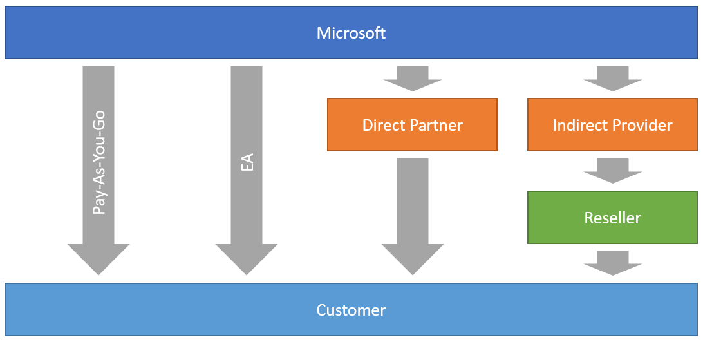

## Azure billing reports

### Different ways of buying Azure Services (Pay-As-You-Go, EA, Direct CSP, Indirect CSP)
Here is a diagram that illustrates the relationships in this model : \


### Indirect CSP Reseller (Tier2)
For partners just starting out selling CSP, becoming an Indirect Reseller is usually the most sensible option. The requirements for Indirect Resellers are relatively simple. \
Indirect Resellers establish a relationship with an Indirect Provider or Distributor. The Distributor maintains the relationship with Microsoft. The Indirect Reseller maintains the relationship with the Distributor. Because there is a Distributor between the Reseller and Microsoft, they use the term “Indirect Reseller”.

### Authentication
You must create a key to call Arrow API : https://xsp.arrow.com/index.php/apidoc/keys \
The examples in this section use the (non-working) credentials in the following table.
<table>
  <tr>
    <th>Parameter</th>
    <th>Value</th>
  </tr>
  <tr>
    <td>KeyName</td>
    <td>ArrowEXAMPLE</td>
  </tr>
  <tr>
    <td>Key</td>
    <td>EYSEXvsjFcEXAMPLEKEY</td>
  </tr>
  <tr>
    <td>Secret</td>
    <td>SecretEXAMPLE</td>
  </tr>
</table>

### python script example
minimum version : Python 3.6.x
```python
# -*- coding: utf-8 -*-
import config
import requests,json,logging,urllib3,datetime,mysql.connector
from mysql.connector import Error
from datetime import datetime,date
from dateutil.relativedelta import relativedelta
```

### Environment variable
- Variables should be adapted for your specific context
```python
today         = date.today()
endDate       = date(today.year, today.month, 1)
startDate     = endDate + relativedelta(months=-1)
az_month      = startDate.strftime("%Y-%m")
BillingPeriod = startDate.strftime("%Y-%m-28")
log = "/var/log/az_billing.log"
logging.basicConfig(filename=log,level=logging.DEBUG,format='%(asctime)s %(message)s', datefmt='%d/%m/%Y %H:%M:%S')
```

### VAULT AppRole authentication method
```python
vault_role_id     = config.vault_role_id
vault_secret_id   = config.vault_secret_id
vault_login_path  = config.vault_login_path
suivi_secret_path = config.suivi_secret_path
az_secret_path    = config.az_secret_path
```

```python
#Get vault token authentification with AppRole
def get_az_vault_credentials(vault_role_id,vault_secret_id,vault_login_path,az_secret_path):
    ##if Orange CA not installed
    urllib3.disable_warnings()

    payload = {"role_id": vault_role_id, "secret_id": vault_secret_id}
    r = requests.post(vault_login_path, json=payload, verify=False)
    token = r.json()['auth']['client_token']
    r = requests.get(az_secret_path, headers={"X-Vault-Token":token}, verify=False)
    if r.status_code == 200:
        logging.info(f"Vault token: {r.status_code}")
        vault_result = r.json()
        return vault_result
    else:
        logging.info(f"vault token error: {r.status_code}")
```

### Get arrow url + credentials
```python
az_customers_url   = 'https://xsp.arrow.com/index.php/api/customers'
az_orders_url      = 'https://xsp.arrow.com/index.php/api/orders'
az_consumption_url = 'https://xsp.arrow.com/index.php/api/consumption/license'
vault_result       = get_az_vault_credentials(vault_role_id,vault_secret_id,vault_login_path,az_secret_path)
az_apikey          = vault_result['data']['apikey']
az_signature       = vault_result['data']['signature']
az_headers         = {'apikey': f'{az_apikey}','signature': f'{az_signature}','Content-Type': 'application/json'}
```

### Get Customers
```python
def get_customers(az_orders_url,az_customers_url,az_headers):

    customers_list = {}

    r = requests.get(az_customers_url, headers=az_headers)
    if r.status_code == 200:
        logging.info(f"Azure customers url: {r.status_code}")   
        nb_azure_customers = r.json()
        for azure_customers in nb_azure_customers['data']['customers']:
            Reference   = azure_customers['Reference']
            TenantName  = azure_customers['CompanyName']
            Id          = azure_customers['InternalReference']
            LastName    = (azure_customers['Contact']['LastName']).upper()
            FirstName   = (azure_customers['Contact']['FirstName']).lower()
            Contact     = f"{FirstName} {LastName}"
            Email       = azure_customers['Contact']['Email']
            Tag       = 'azure'

            customers_list[Reference] = {'TenantName':TenantName,'Reference':Reference,'Id':Id,'Contact':Contact,'Email':Email,'Tag':Tag}
    else:
        logging.info(f"Azure customers url error: {r.status_code}")

    r = requests.get(az_orders_url, headers=az_headers)
    if r.status_code == 200:
        logging.info(f"Azure orders url: {r.status_code}")
        nb_azure_orders = r.json()
        for azure_orders in nb_azure_orders['data']['orders']:
            Reference = azure_orders['customer']['reference']
            Status    = azure_orders['status']
            Created   = azure_orders['dateCreation']      

            if Reference in customers_list:
                customers_list[Reference]['Status'] = Status
                customers_list[Reference]['Created'] = Created
    else:
        logging.info(f"Azure orders url error: {r.status_code}")
    
    for az_customers in customers_list.values():
        Reference   = az_customers['Reference']
        TenantName  = az_customers['TenantName']
        Contact     = az_customers['Contact']
        Email       = az_customers['Email']
        Tag         = az_customers['Tag']
        if "Status" in customers_list:
            Status  = az_customers['Status']
        if "Created" in customers_list:
            Created = az_customers['Created']
        Id          = az_customers['Id']

        print(Reference,TenantName,Contact,Email,Tag,Status,Created,Id)

    logging.info(f"Azure customers have been updated")
```

### Get monthly consumption from Arrow (the last bill)
```python
def get_consumption(az_orders_url,az_consumption_url,az_headers,az_month,BillingPeriod):
    
    Tag    = 'azure'
    az_month=str(az_month)
    
    r = requests.get(az_orders_url, headers=az_headers)
    if r.status_code == 200:
        logging.info(f"Azure orders url: {r.status_code}")
        nb_azure_orders = r.json()
        
        #get SAAS information
        for azure_orders in nb_azure_orders['data']['orders']:
            Reference       = azure_orders['customer']['reference']
            ProductFilter   = azure_orders['products']
            
            for i in ProductFilter:
                if "SAAS" in i['sku']:
                    License          = i['license']['reference']
                    Service          = i['sku']
                    Category         = 'License'
                    SubCategory      = 'N/A'
                    Quantity         = i['quantity']
                    Region           = 'N/A'
                    Unit             = 'N/A'
                    UnitPrice        = 'N/A'
                    Amount           = i['prices']['buy']
                    DiscountedAmount = Amount
                    
                    print(Reference,Region,Service,Category,SubCategory,Quantity,Unit,UnitPrice,Amount,DiscountedAmount,Tag,BillingPeriod)

        #get IAAS information  
        for azure_orders in nb_azure_orders['data']['orders']:
            Reference       = azure_orders['customer']['reference']
            License         = azure_orders['products'][0]['license']['reference']
            ProductFilter   = azure_orders['products'][0]['sku']       

            if "IAAS" in ProductFilter:
                consumption_url = az_consumption_url+'/'+License+'?month='+az_month+'&columns[0]=Vendor Ressource SKU&columns[1]=Vendor Product Name&columns[2]=Vendor Meter Category&columns[3]=Vendor Meter Sub-Category&columns[4]=Resource Group&columns[5]=UOM&columns[6]=Country currency code&columns[7]=Level Chargeable Quantity&columns[8]=Region&columns[9]=Resource Name&columns[10]=Country customer unit&columns[11]=Vendor Billing Start Date&columns[12]=Vendor Billing End Date&columns[13]=Cost Center&columns[14]=Project&columns[15]=Environment&columns[16]=Application&columns[17]=Custom Tag&columns[18]=Name&columns[19]=Usage Start date'        
                r = requests.get(consumption_url, headers=az_headers)
                if r.status_code == 200:
                    logging.info(f"Azure consumption url: {r.status_code}")
                    az_consumption = r.json()

                    for value in az_consumption['data']['lines']:
                        if value != []:
                            Service          = value[12]
                            Category         = value[13]
                            SubCategory      = value[11]
                            Quantity         = value[17]
                            Region           = value[18]
                            Unit             = value[15]
                            UnitPrice        = value[1]
                            Amount           = (Quantity*UnitPrice)
                            DiscountedAmount = Amount
                            
                            print(Reference,Region,Service,Category,SubCategory,Quantity,Unit,UnitPrice,Amount,DiscountedAmount,Tag,BillingPeriod)
                else:
                    logging.info(f"Azure consumption url error: {r.status_code}")
    else:
        logging.info(f"Azure orders url error: {r.status_code}")
    logging.info(f"Consumption usage details from Azure have been imported")
```
